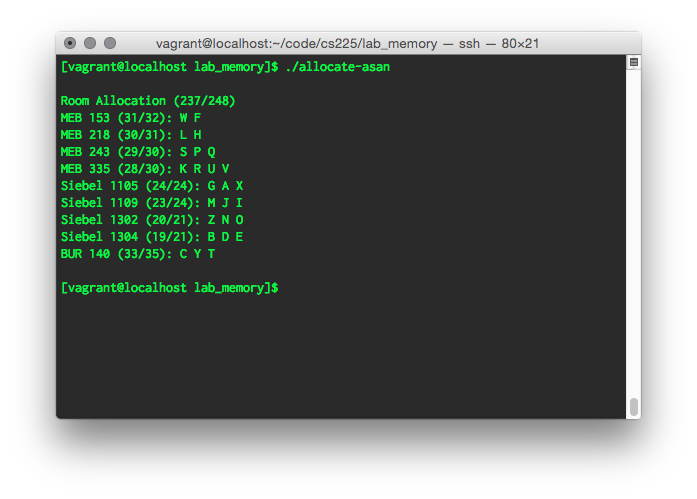
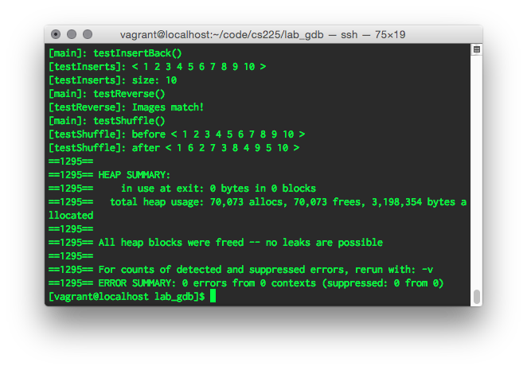

# Instructions

## Setup

First, install [virtualbox](https://www.virtualbox.org/wiki/Downloads) and the [virtualbox extension pack](https://www.virtualbox.org/wiki/Downloads).

Download [vagrant](https://www.vagrantup.com/downloads.html) for your system and install it.

Then, download this repository and unzip it to a directory on your machine.

or clone it locally using `git`:

    git clone https://github.com/hckr/cs225-uiuc-vagrant.git

In Terminal, navigate to where you extracted or cloned the `cs225-uiuc-vagrant` repo (e.g. `~/Code/cs225-uiuc-vagrant`):

	cd ~/Code/cs225-uiuc-vagrant

Then run the setup script:

	./setup.sh

This script will create a `../data` folder one level up from the `cs225-uiuc-vagrant` directory. This folder will be shared with the vagrant VM, so you can edit files using the host machine. In the VM, the `data` folder is in `~/code` 

This means that if this repo is located at `~/Code/cs225-uiuc-vagrant`, then you can modify/add/delete the MP and lab source code within OS X rather than the VM.

The setup script will then provision the VM to install the required software for `cs225`.

## Usage

To enter a commandline prompt within the vagrant VM, run this:

	vagrant ssh

You'll then see something like this:

	[vagrant@localhost ~]$

Put anything you want to access from within OS X in the `~/code` folder in the VM.

To check out the cs225 course MPs and lab materials, you can either run the following from within the VM:

	[vagrant@localhost ~]$ cd ~/code && svn co https://subversion.ews.illinois.edu/svn/sp15-cs225/NETID/ cs225
 
where `NETID` is your...@illinois.edu NetID.

Or run this in OS X in the `data` folder: 

	[me@OSX]$ cd PATH_TO_DATA_FOLDER && svn co https://subversion.ews.illinois.edu/svn/sp15-cs225/NETID/ cs225

where `PATH_TO_DATA_FOLDER` is the path to where `data` is in OS X (e.g. `~/stuff/data`).

Now you can compile your labs/MPs from within the vagrant VM and run their resulting executables through `valgrind` or `asan`:

